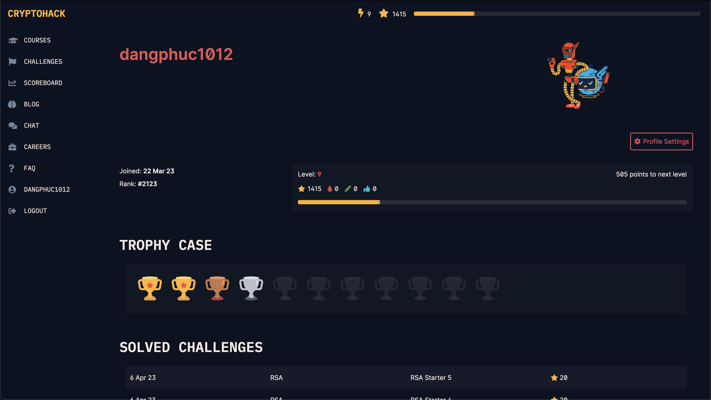
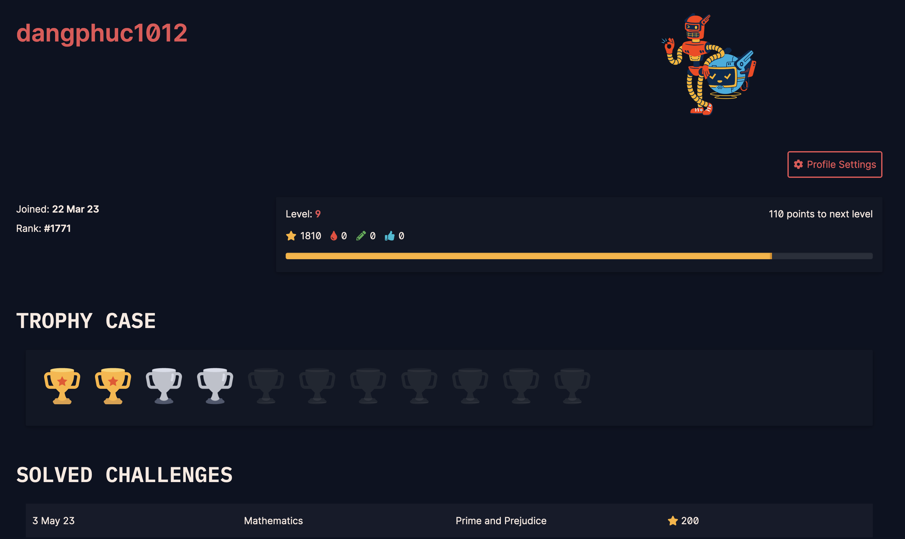

# CRYPTOHACK Write up
* Author: Dang Nguyen Phuc.
* Ho Chi Minh University of Technology.
## Courses: 
### Course 1: Introduction: Done.
### Course 2: Modular: Done.
### Course 3: Symmetric: Done.
### Course 4: Public Key Cryptography: Done.
### Course 5: Elliptic Curve: On working
* 06/04/2023:

* 04/05/2023:

* 06/05/2023:

* 11/05/2023:

### ...

## Challenges:
### Introduction: Done.
### General: Done.
### Mathematic: On working ...
### Symmetric Cipher: On working ...
### RSA: On working ...
### Diffie-Hellman: On working ...
...
